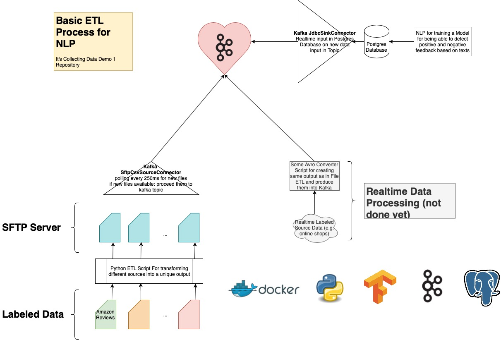

# Full File ETL Demo - Readme



A demo Repository for an automated Labeled Data ETL process.

## Requirements
- Docker (it will require 2GB RAM or more)
- Jupyter-Notebook (optional)
- Python 3.7 or higher + Tensorflow, Pandas, Matplotlib

### Setup
Different setups are included:
1. Small Setup for an ETL process with 100 rows of data
2. Bigger Setup for an ETL process with 100k rows of data

Both setups are executable by using:
```
bash small_demo_run.bash
```

```
bash full_demo_run.bash
```

**Warning** The bash setup is not 100% stable. Sometimes it works,
sometimes not. (see more at known Bugs)


## Workflow
The Repository is divided into different services:
1. Postgres Database (+ an NLP - which is not performing very well)
2. Kafka & Confluent tools
3. an ETL Script in Python + OpenSSH service

The goal for this script is to create a pipeline for files from the
Python script to store them into the Postgres database.

Files are transformed inside of the Python Script and processed into
an OpenSSH server where a Kafka Connector is connected to and will
process new files in near realtime (latency: 250ms) into a Kafka
topic.

A Sink connector is consuming that Kafka Topic and will write new 
inserts into a postgres Database.

**Funfact** usually the developers would need to provide a schema.
In this setup will Kafka Connect interpretate the schema intuitive
from CSV file format and send it to the postgres database.

**No Funfact** since Kafka handles the schema interpretation and
files might be distributed and processes are parallel, it's not very
easy to handle a global primary key. That is why no primary key is
in use. But: The database is used for training, not for searching and
will always processed completely.

## Why so complicated?!
The basic idea of the project in general is to have one central place
where you are able to poll data from - Kafka.

The process at it's own is far to complex. But it brings a lot of
pros in an overall use case.

Just imagine: Kafka is not included. You would need to load data 
directly from etl script into the source database.
As soon as an additional system comes into the game which should
also store the data, you would need to modify the already existing
Python script for being able to send that data to additional sources.

By using kafka in the middle, you are able to add as many sources as
you like without modifying an already running Python script -
_Never change a running system_.

Another pros are streaming aspects. You might have realized an
additional property in the output schema which won't make sense in
the current usecase: `is_streaming`. But Confluent has a great
system: KSQL. It allows you in realtime to make specific decisions.
Just imagine you want to process realtime labeled data from Google
Play Store for your app. You might want to be able to react directly
on new feedback. By using KSQL you would be able to filter that new
data points and proceed them in realtime while they stream in.

An other pro in Kafka is the scalability. You can distribute one
topic through different nodes for being able to replica your data
or to shard your data through different topics for increasing the
speed and allowing data persistency if any server has downtime:
- Kafka Broker (downtime is provided by Replications)
- Consumer Clients (downtime would not be bad since all consumers
    are using offsets for remembering the last consumed message. If
    your consumer has a downtime, it will be able to proceed data
    from last point on)
- Asynchronous consuming of same messages through different services

Long Story Short: If only files should be proceed into a single 
database, I do not recommend to use such an approach. But if a bigger
system is in used with many microservices, I would go with this
approach.

## Known Bugs
Different Problems are included and (hopefully) provided by correct
setup ordering.

- Before Kafka ETL Source Connector is executable, the openSSH
    container needs to include a specific directory structure.
    It's done by letting the small Python script run before 
    initializing the connectors.

- Before it's possible to initialize a connector, it's important to
    have an healthy state in `Kafka-Connect`. It's realized by an
    wait script in bash which waits until 
    `http://localhost:8083/connectors` is available

- Sometimes the bash script starts, sometimes not. It depends on
    health state of Kafka, Zookeeper or something else. Check in an
    additional terminal by using `docker ps` which services are up
    and running if you wait to long for a connection to kafka
    connect. You might need to restart this process.
